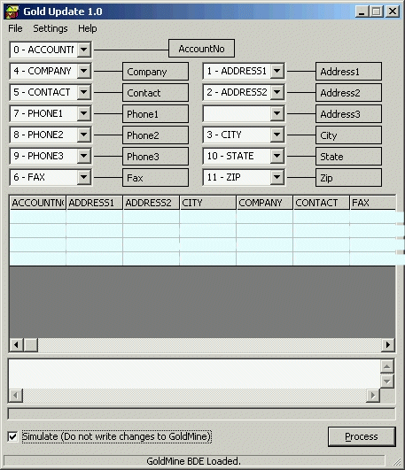



## GoldMine Update 1\.0

### Description

This program will import any DBF file into GoldMine using the DBF to update existing records based on the AccountNo.

This enables you to take your GoldMine data, export the entire Contact1 file, run cleanup on it and standardize it, then pull it back into GoldMine to update changes made to the file.

This uses BDE and the GoldMine 5 API which you must have to run successfully, also contains a simulation mode which will not update GoldMine but will read and show changes in a CSV log. Also note that this import process by using the API does update sync information. As always use at your own risk, try a small test file, and vote ;p
 
### More Info
 

             |
---                |---
**Submitted On**   |2001-06-28 14:32:06
**By**             |[Michael A\. Schmidt](https://github.com/Planet-Source-Code/PSCIndex/blob/master/ByAuthor/michael-a-schmidt.md)
**Level**          |Advanced
**User Rating**    |4.0 (8 globes from 2 users)
**Compatibility**  |VB 6\.0
**Category**       |[Complete Applications](https://github.com/Planet-Source-Code/PSCIndex/blob/master/ByCategory/complete-applications__1-27.md)
**World**          |[Visual Basic](https://github.com/Planet-Source-Code/PSCIndex/blob/master/ByWorld/visual-basic.md)
**Archive File**   |[GoldMine U2185562820\.zip](https://github.com/Planet-Source-Code/michael-a-schmidt-goldmine-update-1-0__1-24536/archive/master.zip)

